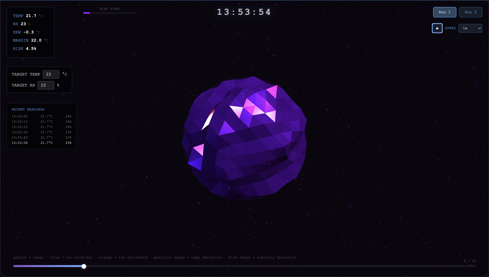
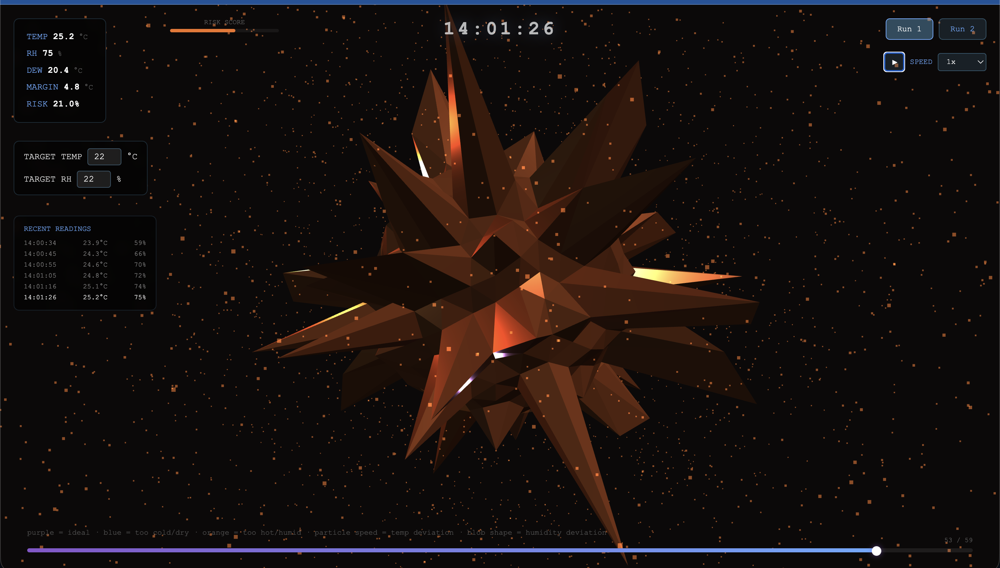

# DewPoint Lens

I built DewPoint Lens for the Inator Chemistry Hackathon because I wanted to explore a different way of looking at reaction data.

DewPoint Lens turns temperature and humidity readings from a Pico into a live, reactive 3D visual that reflects how stable (or unstable) your reaction environment is while still keeping precise logs for accuracy.

Alongside the practical motivation, this was also a small exploration into alternative data representation. I was curious whether reaction conditions could be interpreted spatially rather than numerically treating environmental data as something dynamic and perceptible.

It's designed to be used as a component inside a larger dashboard or a widget, not as a standalone app.

## Why

In chemistry, reaction yield is incredibly sensitive to environmental conditions.

A few degrees difference in temperature or a humidity shift can affect:
- Reaction kinetics
- Solvent behaviour
- Equilibrium position
- Evaporation rate
- Overall reproducibility

When you're running experiments or monitoring a setup, constantly scanning numbers isn't always the most intuitive way to detect instability.

DewPoint Lens adds a visual layer on top of traditional logs so deviations become obvious immediately, without replacing numerical precision.

## Screenshots

**Within optimal range** : smooth purple form, slow particles, stable readings:



**Above setpoint** : expanded, spiky form, fast particles, conditions drifting:



## What It Does

Using a Pico W and a DHT11 sensor, DewPoint Lens captures:
- Temperature (°C)
- Relative humidity (%RH)
- Dew point
- Derived volatility and deviation metrics
- Excursion/risk scoring

You define your target reaction conditions (your setpoints).

The visual then morphs depending on how far real world conditions move away from that ideal envelope.

## How the Visual Works

The 3D form represents environmental stability relative to your defined reaction parameters:

- **Smooth purple form** = within optimal range
- **Blue / contracted state** = below setpoint
- **Orange / expanded state** = above setpoint
- **Increased surface distortion** = humidity deviation
- **Faster particles** = higher thermal deviation (inspired by molecular kinetic energy)

## Designed to Plug Into a Bigger System

You don't enter temperature or targets twice.
Your parent system remains the single source of truth.

The component exposes:

```js
DewPointLens.setTargets(25, 45)
DewPointLens.loadData(myDataArray)
DewPointLens.pushReading({...})
DewPointLens.setSpeed(50)
DewPointLens.seekTo(0.75)
```

Targets and data flow in from your main application.
DewPoint Lens simply visualises them.

It can be embedded via iframe or script include.

## Playback & Analysis

- Live monitoring mode
- Timeline scrubbing (like a video)
- Replay speeds up to 100x
- Quick review of long-duration reaction logs

This makes it useful not just during a reaction, but afterwards especially for identifying when and why yield dropped.

## Pipeline

Sensor → Serial Capture → Feature Engineering → Visual Rendering

```
pip install pyserial numpy
python3 capture.py --duration 300
python3 features.py data/capture.csv
```

Live visualisation runs in `live_visual.html`.

## Hardware

Pico W + DHT11:
- Data → GP15
- VCC → 3V3
- GND → GND
- 10k pull-up resistor

Example MicroPython:

```python
import machine, dht, time
sensor = dht.DHT11(machine.Pin(15))
print("elapsed_s,temp_c,humidity")
start = time.ticks_ms()
while True:
    time.sleep(10)
    sensor.measure()
    elapsed = time.ticks_diff(time.ticks_ms(), start) // 1000
    print(f"{elapsed},{sensor.temperature()},{sensor.humidity()}")
```

## The Intention

DewPoint Lens isn't trying to replace graphs. It's trying to make environmental stability more intuitive something you can recognise visually before digging into the numbers.

The goal is simple: support better control of reaction conditions and, ultimately, more consistent yield.
